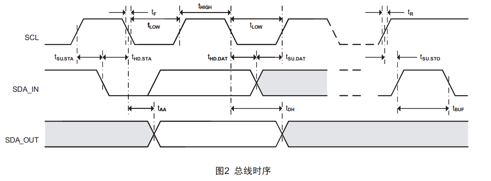

# module-i2c_gpio
    主仓：https://gitee.com/oldking-ecu
    镜像：https://github.com/oldking-ecu

#### 介绍

本项目采用 GPIO 模拟 I2C 通讯方案，相比硬件I2C具备移植性强、简单通用的优势，可高效支撑CDD快速验证工作。
传统 GPIO 模拟 I2C 通常需封装 6-7 个基础函数（start、stop、write、read、write_ack、write_nack、read_ack 等），本项目对此做了创新优化，仅精简封装start、write_chk_ack、read_set_ack、stop 4个核心函数，大幅简化代码结构。
同时，方案对连接 SCL、SDA 的 GPIO 做了统一封装，兼顾SDA 不支持开漏输出的硬件兼容场景；时序层面开放常用参数配置，灵活性拉满。经 STM32 实测，通讯时钟速度可达 200k+，性能可满足绝大多数实际应用需求。

#### 软件架构

详情见B站网址:[keel代码框架案例分析-I2c_Gpio模块](https://www.bilibili.com/video/BV1iFFZzBEf7/?share_source=copy_web&vd_source=64c3d4dffc93e47357ce5ad280f13d59)


#### 使用说明

#### 1.配置
配置分IO驱动和I2C时序，IO移植需要提供SCL和SDA的输出高低电平函数、对于SDA不支持开漏输出的需要实现set_sda_dir的接口，GPIO初始化要提前配置SCL和SDA为输出，还需要提供一个us延时函数。  
   I2C时序参数如下，提取了大部分常用的参数进行配置，具体可以参考user_demo中代码
#### 2.使用
使用接口如下
```c
void I2cGpio_Start(uint8 ins);
uint8 I2cGpio_WrDatChkAck(uint8 ins, uint8 data);
uint8 I2cGpio_RdDatSendAck(uint8 ins, uint8 ack);
void I2cGpio_Stop(uint8 ins);
```
利用这几个函数进行组合，可以方便实现如eeprom的读写驱动
```c
uint8 Eeprom_Write(uint8 devAddr, uint8 addr, uint8 *wdata, uint16 size)
{
	uint16 i;
	I2cGpio_Start(I2C_GPIO_INS_EEPROM);
	if (!I2cGpio_WrDatChkAck(I2C_GPIO_INS_EEPROM, devAddr)) {
		I2cGpio_Stop(I2C_GPIO_INS_EEPROM);
		return 1;
	}
	if (!I2cGpio_WrDatChkAck(I2C_GPIO_INS_EEPROM, addr)) {
		I2cGpio_Stop(I2C_GPIO_INS_EEPROM);
		return 1;
	}
	for (i = 0; i < size; i++) {
		if (!I2cGpio_WrDatChkAck(I2C_GPIO_INS_EEPROM, wdata[i])) {
			I2cGpio_Stop(I2C_GPIO_INS_EEPROM);
			return 1;
		}
	}
	I2cGpio_Stop(I2C_GPIO_INS_EEPROM);
	return 0;
}
uint8 Eeprom_Read(uint8 devAddr, uint8 addr, uint8 *rdata, uint16 size)
{
	uint16 i;
	I2cGpio_Start(I2C_GPIO_INS_EEPROM);
	if (!I2cGpio_WrDatChkAck(I2C_GPIO_INS_EEPROM, devAddr)) {
		I2cGpio_Stop(I2C_GPIO_INS_EEPROM);
		return 1;
	}
	if (!I2cGpio_WrDatChkAck(I2C_GPIO_INS_EEPROM, addr)) {
		I2cGpio_Stop(I2C_GPIO_INS_EEPROM);
		return 1;
	}
	I2cGpio_Start(I2C_GPIO_INS_EEPROM);
	if (!I2cGpio_WrDatChkAck(I2C_GPIO_INS_EEPROM, devAddr | 0x01)) {
		I2cGpio_Stop(I2C_GPIO_INS_EEPROM);
		return 1;
	}
	for (i = 0; i < size - 1; i++) {
		rdata[i] = I2cGpio_RdDatSendAck(I2C_GPIO_INS_EEPROM, TRUE);
	}
	rdata[i] = I2cGpio_RdDatSendAck(I2C_GPIO_INS_EEPROM, FALS);
	I2cGpio_Stop(I2C_GPIO_INS_EEPROM);
	return 0;
}
```
更多示例可以参考cdd-ina226和cdd-sc8815


#### 参与贡献

1.  Fork 本仓库
2.  新建 Feat_xxx 分支
3.  提交代码
4.  新建 Pull Request


#### 支持本项目

若这个项目帮到了你，不妨点个星标~，愿意的话也可以小额捐赠，感谢每一份认可~~


#### 捐赠者致谢

感谢以下朋友支持(按捐赠时间排序)
1. XXX
